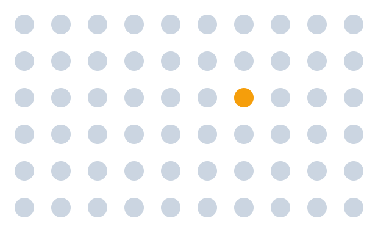
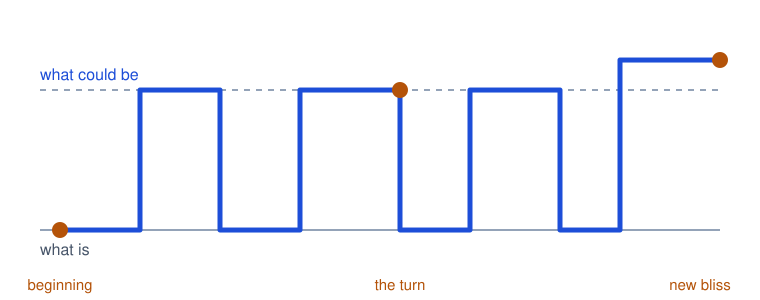

# CPSC 403: Computer Science Seminar

## Week 1, September 8, 2026

Ken Kousen · kkousen@trincoll.edu

Trinity College · Fall 2026

---
layout: center
---

# Today

<v-clicks>

- What this course is for, and what it is not
- Danny Briere: Elting Center and AI Center senior projects (about 20 minutes)
- CPSC 498: how to register and who can advise
- Two talks, three short pieces, one pitch to the faculty
- Absences, and the memo that fixes them
- Chapter 1 of *Resonate*: why most presentations fail
- Your first assignment: the "anything" talk

</v-clicks>

---

# About me

- Trinity CS since 2022; also teaching CPSC 415, AI Integration, on Mondays
- Thirty years of technical training and conference talks: Java, Spring, Kotlin, AI
- Author of *Claude Code: Up and Running* and several other books

<strong>Office hours:</strong> Tuesdays 10 AM to noon, MECC 175, or by appointment.

---

# What this course is for

<v-clicks>

- The catalog says: research presentations, critical discussion, the senior exercise
- In practice: **one skill.** Presenting technical work so an audience understands it, cares, and acts
- The real deliverable is in April: a ten-minute talk on your senior project at the department's student conference
- A Travelers representative attends. Prizes go to the best talks.
- This fall builds the skills. The spring polishes the talk.

</v-clicks>

---

# What this course is not

- Not the place your senior project happens. That is CPSC 498 with your advisor.
- Not a lecture course. Most weeks, you are the content.
- Not graded on how impressive your topic is.

A ten-minute talk about your grandmother's recipes that does the right things beats a ten-minute talk about distributed consensus that does not.

---
layout: section
---

# Danny Briere
## Elting Center for Innovation and Entrepreneurship

---

# CPSC 498: Senior Project Part 1

Every senior registers for CPSC 498 this fall and CPSC 499 in the spring, alongside this seminar.

<v-clicks>

1. **Talk to a faculty advisor first.** You need enough of an idea for them to say "yes, let's start." Projects change; that is expected.
2. **Then submit the special registration form** on the Registrar's site. Link on Moodle.
3. Teams of one to three. Twenty of you across two sections; the aim is twelve or fewer teams.

</v-clicks>

---

# Who can advise this year

| Faculty | Notes |
|---|---|
| Ewa Syta | Security-related projects |
| Nil Chakraborttii | |
| Jonathan Johnson | |
| Takunari Miyazaki | |
| Madalene Specialetti | |
| Ken Kousen | AI Center projects with government and industry partners |

Peter Yoon is on leave this fall.

---

# The shape of the semester

| When | What |
|---|---|
| Weeks 1 to 2 | *Resonate* chapters 1 to 3. Sign up for a talk. |
| Weeks 3 to 6 | **Presentation 1**, the "anything" talk. Chapters 4 to 7. |
| Week 7 | Post-mortem 1. Project teams settling. |
| Weeks 8 to 11 | **Presentation 2**, the project pitch. Chapters 8, 9, coda. |
| Weeks 12 to 13 | Post-mortem 2. Rehearsing the faculty pitch. |
| Finals week | **Preliminary pitch to the faculty.** Ten minutes per team. |

No class October 13 (Trinity Days). November 24 meets.

---

# Two sections, one course

- Section 01 at 1:30, Section 02 at 2:55, both in this room
- Identical content, identical Moodle pages
- **Attend whichever section works in a given week.** I do not care which.
- The sign-up sheet covers both sections: three talk slots per section per week

---

# Grading

| Component | Weight |
|---|---|
| Attendance and participation | 20% |
| Presentation 1: the "anything" talk | 15% |
| Presentation 2: the project pitch | 25% |
| Writing: three short pieces, pass/redo | 20% |
| Preliminary faculty pitch | 20% |

Talks are graded on the <em>Resonate</em> principles, not on the topic.

---

# Three short pieces of writing

All **pass/redo**. No numeric grade. If it is thin, it comes back once with a note.

<v-clicks>

1. **Talk analysis**, due September 22. Pick a recorded talk under twenty minutes, given to a real audience. Write the post-mortem you would write for a classmate, in Duarte's vocabulary.
2. **Post-mortem 1**, one week after your first talk. What you intended, what landed, what did not, what you will change.
3. **Post-mortem 2**, one week after your second talk. Same, plus: did you change what you said you would?

</v-clicks>

---

# Attendance is an obligation to each other

<v-clicks>

- We meet once a week. One absence is a big slice of the course.
- After every talk, the room gives feedback. That only works if there is a room.
- If you are absent on a day a classmate presents, you took something from them.

</v-clicks>

<strong>Miss a class?</strong> Submit a one-page memo on Moodle before the next class: key points, action items, and one line that is yours: the most important takeaway, or a question you would have asked. The memo turns an unexcused absence into an excused one. No memo, it counts.

---

# Where things live

- **Moodle**: announcements, submissions, grades, links to everything else
- **GitHub**: github.com/kousen/senior-seminar-course. Syllabus, assignment sheets, these slides.
- **Sign-up sheet**: Google Sheet linked from Moodle. First come, first served.
- **Zoom**: every class is recorded. Link on Moodle.
- **Resonate**: free online edition with registration. Link on Moodle.

Due by next week: the Academic Honesty Pledge on Moodle. Read the syllabus first.

---
layout: section
---

# Chapter 1
## Why Resonate?

---
layout: image-right
image: ./images/chladni-plate.jpg
---

# Resonance is physics first

Salt on a metal plate, driven by a speaker. At the right frequency the grains stop bouncing and settle into a pattern, as if they knew where to go.

<strong>You tune the message to the audience.</strong> The audience does not tune itself to you.

Nobody changes their mental model because a slide told them to. They change it when what you say fits something already in their head.

---
layout: two-cols
---

# Why most presentations are boring

Not because the material is dull.

Because **nothing changes** for the whole time: same tone, same slide shape, same pace.

Camouflage is never the right move for an idea. Be the orange one.

Duarte's test before doing the work: <em>how badly do I want this idea to live?</em>

::right::

---
layout: image-right
image: ./images/bonfire.jpg
---

# Facts alone fall short

People agree with an argument and still do nothing. Being convinced is not being moved.

The engineer's objection: *"They pay me to do, not to feel."*

Duarte's answer: keep every fact. Add the reason anyone should care.

"We cut latency 40%" is a fact. 
"The demo froze in front of the client, and here is what we found" is a story that contains the fact.

Good personal stories show a flaw or a failure. That is exactly why they work.

---
layout: image-right
image: ./images/mentor-telemachus.jpg
---

# You are not the hero

The original Mentor, pointing Telemachus toward the boat while everyone else holds him back.

That is your job in a talk.

<strong>The audience is the hero.</strong> You are the mentor: you have been down the road, and you hand them what they need to get unstuck.

What you want them thinking on the way out: "I have tools I did not have an hour ago." Not "wow, that presenter is smart."

---
layout: center
---

# Rule 1: Resonance causes change

What do I want the people in this room to believe or do when I stop talking?

---

# Try it now (three minutes)

Turn to the person next to you.

1. Name a topic you might use for the "anything" talk.
2. Finish this sentence out loud: *"When I stop talking, I want you to..."*
3. Swap.

Keep the sentence. It is the first line of your talk analysis, your post-mortem, and your slides.

---
layout: center
---

# Your first assignment: the "anything" talk

<v-clicks>

- **Ten minutes.** Alone or with one partner.
- **Any topic you care about.** A hobby, a sport, a trip, a side project, an opinion.
- Not your senior project. Teams have not formed yet, and that is the point.
- Sign up for a slot between September 22 and October 20. Three per section per week.
- Slides uploaded to Moodle before class on your day.
- Post-mortem due one week after you present.

</v-clicks>

---
layout: center
---

# For next week

- Read *Resonate* chapters 2 and 3
- Submit the pledge on Moodle
- Talk to a possible advisor
- Start thinking about your talk topic, and about which talk you will analyze

---
layout: center
class: text-sm
---

**Image credits.** Chladni plate: Estes Objethos Atelier, Matemateca IME-USP, CC BY-SA 4.0, via Wikimedia Commons. Bonfire: shixart1985 on Flickr, CC BY 2.0. *Telemachus, Urged by Mentor, Leaving the Island of Calypso*, Charles Meynier, 1800, public domain.
