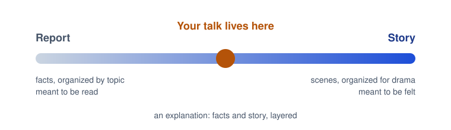
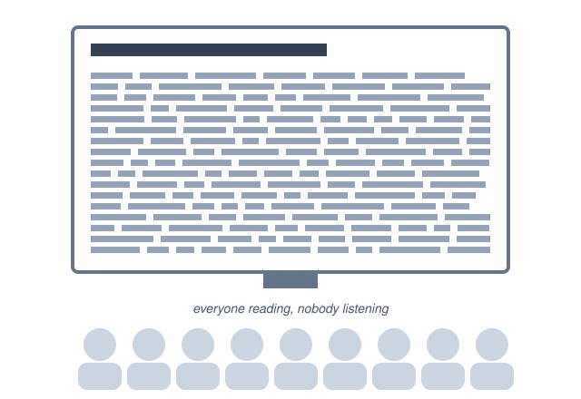
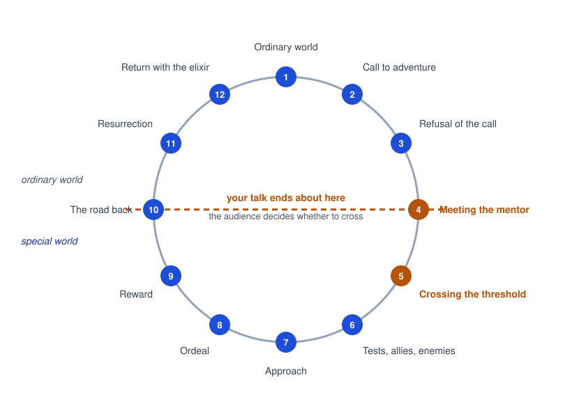
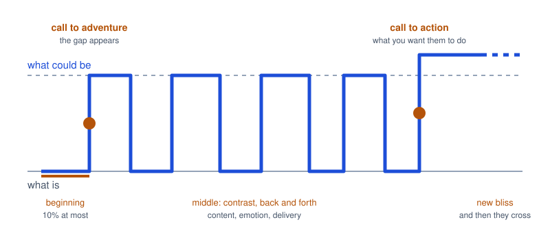
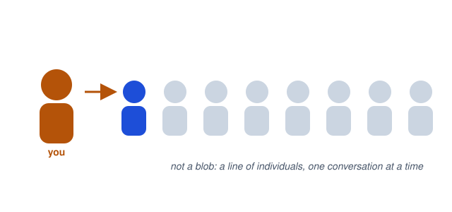
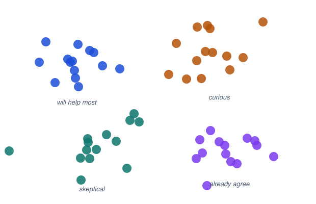
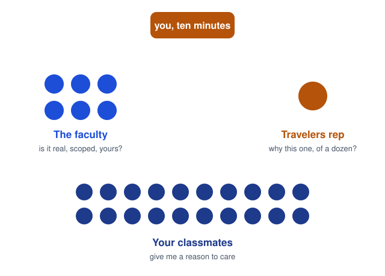
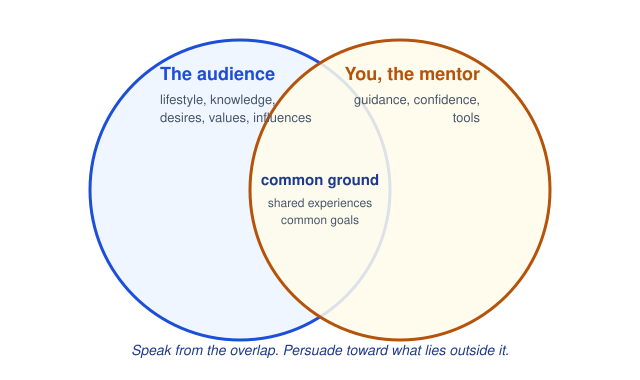

# CPSC 403: Computer Science Seminar

## Week 2, September 15, 2026

Resonate, Chapters 2 and 3: Lessons from Myths and Movies; Get to Know the Hero

Trinity College · Fall 2026

---
layout: two-cols
---

# Check in

Scan the code, pick your name, pick today's section, and type the code word. Lowercase, but I am not picky about case.

Code word: <strong>hal9000</strong>

Same form every week, different word. Timestamps count as attendance.

::right::

---
layout: center
---

# Today

<v-clicks>

- Housekeeping: pledge, CPSC 498, the sign-up sheet
- Chapter 2: why a talk is not a report, and what movies know
- The Presentation Form, the one diagram this course keeps coming back to
- Chapter 3: who is actually in the room
- Your December audience, segmented
- Sketch the shape of your "anything" talk

</v-clicks>

---

# Housekeeping

<v-clicks>

- **Academic Honesty Pledge** is due today on Moodle. Paste, sign, submit.
- **CPSC 498:** have you talked to an advisor? The special registration form is linked on Moodle. Advisor first, then the form.
- **Sign-up sheet:** Round 1 talks start next week, September 22. Three slots per section per week. Grab one.
- **Talk analysis** is due next week, before class. An hour or less, given to a real audience. The sheet is in the repo.
- Recordings from last week are on the Moodle "Class recordings" page, both sections.

</v-clicks>

---
layout: section
---

# Chapter 2
## Lessons from Myths and Movies

---
layout: center
---

# A talk is not a report

A report organizes facts by topic and is meant to be read. A story organizes scenes for drama and is meant to be felt. A talk is an <strong>explanation</strong>: it layers the two.

---
layout: two-cols
---

# The slideument

The document that pretends to be a presentation. Every fact on the screen, the room reading along, the speaker narrating the bullets.

Duarte's point: putting a report into PowerPoint does not make it a talk. It makes it a report you cannot search.

CS version: your final report and your final talk are different artifacts. Write both. Do not project the first one.

::right::

---
layout: two-cols
---

# What every story has

Situation, complication, resolution. Campfire stories, movies, the story of the bug you fixed last week.

Screenwriters formalize it as three acts. The middle is the longest, and two **turning points** separate it from the ends.

Something has to be at stake. If the audience believes nothing is lost when the hero fails, they stop watching.

::right::

<strong>Act 1.</strong> Set up. Who the hero is, what they want, why they cannot have it yet.

<strong>Turning point.</strong> Something happens that changes the direction.

<strong>Act 2.</strong> Confrontation. Obstacles, one after another. Twice as long as the others.

<strong>Turning point.</strong> The last piece falls into place.

<strong>Act 3.</strong> Resolution. Did they get it?

---
layout: two-cols
---

# The hero's journey

Campbell found the same shape in myths everywhere. Vogler cut it to twelve steps for Hollywood.

The line across the middle matters more than the steps. Above it is the **ordinary world**. Below it is the **special world**, where the hero picks up skills and brings them home.

A talk takes the audience only as far as step four. You are the mentor. Whether they <strong>cross the threshold</strong> is their decision, made after you stop talking.

::right::

---
layout: two-cols
---

# What is, and what could be

<v-clicks>

- Every story runs on an imbalance the audience wants resolved.
- In a talk, you create it deliberately: **what is** next to **what could be**, and the gap between them.
- Who the audience is when they walk in, next to who they could be when they walk out.
- No gap, no reason to listen. This is why "here's what we built" talks are inert: nothing was at stake.

</v-clicks>

Last week's sentence, "when I stop talking, I want you to...", is the "what could be." This week you add the "what is."

::right::

---

# The Presentation Form

<strong>Beginning.</strong> Their world, stated so they nod. Ten percent at most.

<strong>Call to adventure.</strong> The gap, clearly and once. The inciting incident.

<strong>Middle.</strong> Back and forth. Contrast in content, emotion, delivery.

<strong>Call to action.</strong> Exactly what to do. Doers, suppliers, influencers, innovators.

<strong>New bliss.</strong> End higher than you started. Last words stick.

---
layout: image-right
image: ./images/nehru-tryst.jpg
---

# Nehru, midnight, August 14, 1947

India's first prime minister, on the eve of independence, to the Constituent Assembly. Four minutes.

Duarte's sparkline of the speech is almost a square wave: what is, what could be, what is, what could be, ending high.

That regularity is the lesson. He did not stay in the future. He kept returning to the present so the future had something to push against.

Look it up: "Tryst with Destiny." Under five minutes, and a good candidate for someone's talk analysis.

---
layout: center
---

# Rule 2: Story has an exponential effect

The same facts, arranged as a story, change more minds than the facts arranged as a list.

Not because the facts got better. Because the audience now wants the imbalance resolved.

---
layout: section
---

# Chapter 3
## Get to Know the Hero

---
layout: two-cols
---

# A love letter addressed "to whom it may concern"

<v-clicks>

- That is a talk designed without an audience in mind. It reads as sincere and lands on nobody.
- An audience is a temporary crowd of individuals who share exactly one thing: your talk. Each one filters it differently.
- Duarte's move: stop picturing a blob. Picture a line of people waiting to talk to you one at a time.

</v-clicks>

People do not fall asleep in conversations. Aim the talk at one person and the others lean in.

::right::

---
layout: two-cols
---

# Segment the audience

<v-clicks>

- Demographics tell you titles and zip codes. They do not tell you what anyone cares about.
- Duarte, presenting to beer executives, did the homework: trade press, their own decks, their annual report, their blogs. She used a fraction of it. All of it made her feel she knew them.
- Segment to find the people who can most help your idea, then speak to them without losing the room.

</v-clicks>

The trap: segmenting so broadly that people feel like a statistic, or so narrowly that they feel stereotyped.

::right::

---
layout: image-right
image: ./images/reagan-challenger.jpg
---

# Reagan, January 28, 1986

The Challenger broke apart seventy-three seconds after launch. Millions of schoolchildren watched, because a teacher was aboard. That evening Reagan gave a four-minute address instead of the State of the Union.

Four minutes, five audiences: the nation, the families, the schoolchildren, NASA, and the Soviet Union.

He spoke to each in turn, then folded them back into one: "we share it." Segmenting did not fracture the audience. It let him reach every part of it.

---
layout: two-cols
---

# Your December audience has three segments

<v-clicks>

- **The faculty.** They want to know the project is real, scoped, and yours. They will ask about method.
- **The Travelers representative.** Sees a dozen pitches back to back. Wants to know why this one matters and what it will look like done.
- **Your classmates.** Twenty people who will grade you with their attention. They want a reason to care.

</v-clicks>

Reagan's trick works at ten minutes too: a line for each, then one line that includes all three.

::right::

---
layout: two-cols
---

# Meet the hero

Six questions Duarte asks about an audience before writing a word.

1. **Lifestyle.** What is a walk in their shoes like? Where do they spend their time?
2. **Knowledge.** What do they already know about your topic? What do they believe that is wrong?
3. **Motivation.** What do they want? What is missing?
4. **Values.** What do they spend time and money on? What unites them?
5. **Influence.** Who do they listen to? How do they decide?
6. **Respect.** How do they give it and receive it?

::right::

<strong>Save the cat.</strong> Screenwriters give the hero a likeable moment early so the audience roots for them. Duarte turns it around: find what is likeable about your audience, and you will speak to them differently.

Answer three of the six about <em>this room</em> before your "anything" talk. It changes the opening.

---
layout: image-right
image: ./images/mentor-telemachus.jpg
---

# Meet the mentor

<v-clicks>

- Mentors teach and give gifts. Mr. Miyagi teaches karate and hands over a lesson about balance that outlasts the tournament.
- Your gift list: **guidance** they did not have, **confidence** to act, and **tools** they can use tomorrow.
- The mentor gets something out of it too. Miyagi got his fence painted. But if the audience senses the talk is for your benefit, they leave.

</v-clicks>

Test for any slide: is this here because they need it, or because I want them to know I know it?

---
layout: two-cols
---

# Create common ground

Shared experiences, common goals, and the one reason you are qualified to guide this particular trip. Say those first, humbly, and the audience relaxes.

Duarte's own failure: in 2007 she warned her young staff a downturn was coming. They had only ever known growth. It landed as manipulation, and it took a year to recover, because she skipped the overlap and went straight to the alarm.

When a talk misfires, the ten fingers point at the presenter. You chose the words.

::right::

---
layout: center
---

# Rule 3: Tune to their frequency and they will move

Know what is already in their heads, then say the thing that fits it.

Chapter 1 said the plate moves at its own frequency. Chapter 3 says: go find out what that frequency is.

---

# Sketch your talk (six minutes)

On paper or a laptop, for the "anything" talk you signed up for. Three lines:

1. **What is.** The audience's ordinary world in one sentence. What do they already believe about your topic?
2. **The gap.** One sentence that shows them something is off, or something is possible. Your call to adventure.
3. **New bliss.** One sentence of what is better once they buy in. Ends higher than line one.

Then swap with a neighbor. Their only job: is line 2 a real gap, or just a topic?

Keep it. That is the first draft of your talk's structure, and the "what I intended" paragraph of your post-mortem.

---
layout: center
---

# For next week

- **Talk analysis due before class.** Look for the sparkline while you watch. Where is the call to adventure? Does it end higher?
- Round 1 talks begin. Three slots per section. Slides to Moodle before class on your day.
- Read Chapter 4, *Define the Journey*.
- If you have not talked to an advisor yet, this is the week.

---
layout: center
class: text-sm
---

**Image credits.** Jawaharlal Nehru delivering the "Tryst with Destiny" speech, 1947, public domain. President Reagan's address on the Space Shuttle Challenger, January 28, 1986, White House photograph, public domain. *Telemachus, Urged by Mentor, Leaving the Island of Calypso*, Charles Meynier, 1800, public domain. Diagrams drawn for this course.
