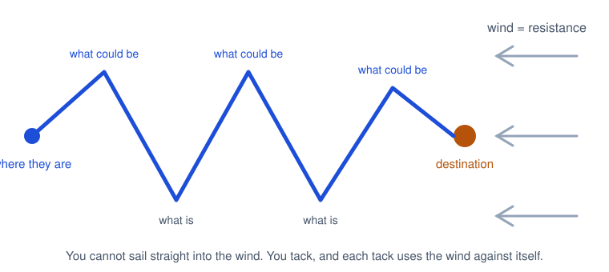
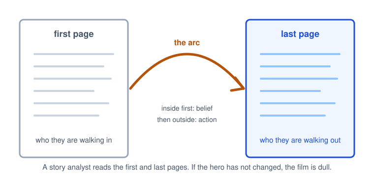
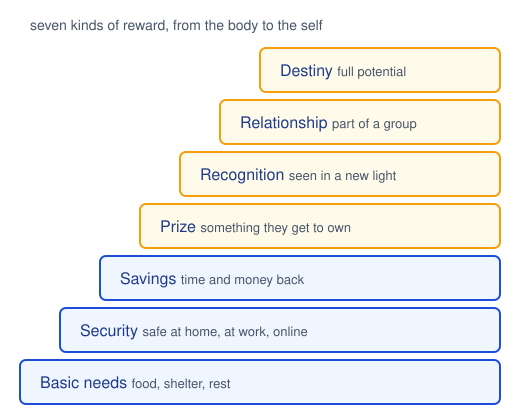

# CPSC 403: Computer Science Seminar

## Week 3, September 22, 2026

Resonate, Chapter 4: Define the Journey. Round 1 talks begin.

Trinity College · Fall 2026

---
layout: two-cols
---

# Check in

Scan the code, pick your name, pick today's section, and type the code word. Lowercase, but I am not picky about case.

Code word: <strong>joshua</strong>

Same form every week, different word. Timestamps count as attendance.

::right::

---
layout: center
---

# Today

<v-clicks>

- Housekeeping: talk analysis, CPSC 498, the sheet
- How a talk day works from here on
- Chapter 4, short version: pick a destination, then plan the trip
- Write your big idea as one sentence
- Three talks, with feedback after each

</v-clicks>

---

# Housekeeping

<v-clicks>

- **Talk analysis** was due before class today on Moodle. Pass or redo; if it comes back, fix it and resubmit.
- **CPSC 498:** add/drop closed last Tuesday. If you are not registered, it now takes a late-add form from the Registrar. Talk to me today.
- **Sign-up sheet:** Round 1 runs through October 20. Slots are filling. If you have not picked one, do it before you leave.
- **Slides** go to Moodle before class on the day you present. One upload per round.
- **Post-mortem 1** is due one week after your own talk. One page, pass or redo, about what you intended versus what happened.
- Last week's recordings are on the Class recordings page. Section 02 too, once Zoom finished.

</v-clicks>

---
layout: two-cols
---

# How a talk day works

<v-clicks>

- Presenters in sheet order. Ten minutes each. I will signal at eight.
- Then three or four minutes of **verbal feedback** from the room.
- Presenter listens and takes notes. No rebuttal, no explaining what you meant. You get to do that in the post-mortem.
- Everyone gives feedback at some point today. That is the attendance part of the grade doing its job.

</v-clicks>

::right::

<strong>Say what landed.</strong> One specific moment that worked, and why.

<strong>Say one thing to change.</strong> One, not five. The most useful one.

<strong>Use the vocabulary.</strong> Where was the call to adventure? Did it end higher than it started? Who was the hero?

---
layout: section
---

# Chapter 4
## Define the Journey

---
layout: image-right
image: ./images/heeling-sailboat.jpg
---

# Set a course first

<v-clicks>

- Nobody sails to Hawaii by unfurling the sails and seeing where the wind goes. You pick the destination, then every decision serves it.
- A talk is the same. Decide where the audience should be when you stop talking. Then every slide either moves them there or gets cut.
- The audience feels the move as a loss. They are leaving a familiar place. Expect resistance.

</v-clicks>

Resistance is wind. Set the sails right and the boat moves <em>against</em> it, faster than the wind itself.

---
layout: two-cols
---

# Tacking is the Presentation Form

<v-clicks>

- A boat cannot point straight into the wind. It zigzags, and each leg converts the headwind into forward motion.
- Duarte's point: the back and forth of a talk, what is, what could be, what is, is not indecision. It is how you make progress against resistance.
- You do not control how hard the wind blows. You control the sails: the message, and how you adjust it as the room pushes back.

</v-clicks>

::right::

---

# The first page and the last page

Studio story analysts judge a script by reading the first page and the last. If the hero is the same person on both, the film is dull.

Do the same for your talk. Write down who the audience is when they walk in, and who you need them to be when they walk out.

Inner change first, outer change second. If they believe something new, they will do something new. Plan both.

December, first page: "another senior project." Last page: "I want to see this one finished."

---
layout: two-cols
---

# The big idea

One sentence that carries the whole talk. Screenwriters call it the controlling idea. Three tests:

<v-clicks>

1. **Your perspective.** "The fate of the oceans" is a topic. "Pollution is killing the ocean, and us" is a point of view.
2. **What is at stake.** Why should they care enough to change? Money, time, safety, reputation, someone else's welfare.
3. **A complete sentence.** Noun and verb. Put **you** in it and you are forced to picture the audience.

</v-clicks>

::right::

<strong>Topic:</strong> "Traffic camera analytics for the City of Hartford."

↓

<strong>Big idea:</strong> "By April, the city will be able to find a stalled car on any of its 1,350 cameras in under a minute, without a person watching a screen."

Perspective, stakes, a verb, and the audience knows exactly what "done" looks like.

---
layout: center
---

# Two emotions, and only two

<strong>If they reject the idea:</strong> raise the odds of pain, lower the odds of pleasure.

<strong>If they accept it:</strong> raise the odds of pleasure, lower the odds of pain.

"We are losing our competitive edge" has nothing at stake. "If we do not get it back, your jobs are at risk" does.

The gravity of the talk should match the stakes. No more, no less. A ten-minute pitch that sounds like a eulogy is as wrong as a layoff announcement that sounds like a product launch.

---
layout: image-right
image: ./images/butterfly-emerging.jpg
---

# Acknowledge the risk

<v-clicks>

- Change means giving something up. A belief they have held for years is an old friend. You are asking them to drop it.
- Even a small ask costs them something irretrievable: an evening, a meeting, a slice of attention.
- The caterpillar does not grow wings. It dissolves inside the cocoon and reassembles. That is what change feels like from the inside.

</v-clicks>

Two questions before you write: what will they <strong>sacrifice</strong> to adopt this, and what do they <strong>risk</strong> if it goes wrong?

---
layout: image-right
image: ./images/jenner-vaccination.jpg
---

# Address resistance

<v-clicks>

- Some of the room will look for holes, because the alternative is living with a contradiction or changing. Both hurt.
- **Inoculate.** State their objection out loud before they can. A small dose of the argument against you, delivered by you, lowers their anxiety.
- Where you see resistance, they see valor. They are protecting something they value. Say so, then show them they are in good hands.

</v-clicks>

Jenner, 1796, vaccinating James Phipps. The word Duarte uses is his.

---

# Refusal of the call: six places to look

<strong>Comfort zone.</strong> How far outside it are you asking them to go?

<strong>Fear.</strong> What keeps them up at night? Which fears are valid, which need dispelling?

<strong>Vulnerabilities.</strong> Recent errors, weaknesses, changes they are still absorbing.

<strong>Misunderstanding.</strong> What could they get wrong about the message or its implications?

<strong>Obstacles.</strong> What practical or mental barrier stops them acting even if they agree?

<strong>Politics.</strong> Who has influence over them? Does your idea shift power?

For the December pitch, the faculty resistance is predictable: "too big for two people in one semester," "who owns the data," "what happens when the API changes." Name them before they do.

---
layout: two-cols
---

# Make the reward worth it

<v-clicks>

- Nobody acts because a talk was engaging. They act because the payoff was clear and worth the sacrifice.
- The reward should be proportional to what you asked them to give up.
- Three scopes: what **they** get, what their **sphere** gets (team, friends, students), and what the wider **world** gets.
- The hero returns from the special world with an elixir. Name the elixir.

</v-clicks>

Last week's "new bliss" now has a definition: the reward, stated so they can feel it.

::right::

---
layout: image-right
image: ./images/beth-comstock.jpg
---

# Case study: "Growth in a downturn?"

<v-clicks>

- General Electric, 2008. Beth Comstock, GE's first chief marketing officer in decades, had to convince her team that growth was possible while the economy collapsed.
- The contrast is in the title. What is: a downturn. What could be: growth anyway.
- Six moves, each a "move from, move to" pair with a benefit and a personal story.
- The stories were her own mistakes: passion that read as aggression, not asking for help. That is what made the ask credible.

</v-clicks>

---

# The move-from, move-to matrix

| | **Move from** | **Move to** | **Benefit** | **Personal story** |
|---|---|---|---|---|
| **Being** (belief) | Paralyzed by not knowing the answers | Accepting you never will | You face reality and make the call | "Jack Welch taught me to wallow in a problem" |
| **Doing** (action) | Afraid to start | Pick a path, knowing the end will differ | Fail fast, fail small | "I regret the times I stayed quiet" |

One of Comstock's six, condensed. A row for belief, a row for action, and the story is hers, not a stock anecdote.

For your project pitch: <strong>from</strong> "this is a student exercise" <strong>to</strong> "this is a tool someone will use." What is the benefit to the room, and what story of yours makes it credible?

---
layout: image-right
image: ./images/newton-kneller.jpg
---

# Rule 4: A body at rest stays at rest

<v-clicks>

- Duarte's wording: every audience will persist in a state of rest unless compelled to change. Newton's first law, applied to a room. Nobody changes because you asked nicely.
- The compelling force is what is at stake, stated plainly, with a reward on the other side of the sacrifice.
- If your talk has no force in it, the audience will be exactly where they started when you finish. That is not their failure.

</v-clicks>

---

# Write your big idea (five minutes)

For the talk you signed up for, or your project pitch if your "anything" talk is already done. Three lines:

1. **The big idea.** One complete sentence, your perspective, stakes included, with the word "you" in it.
2. **The sacrifice.** What are you asking this room to give up or risk? Even ten minutes of attention counts. Say what it costs.
3. **One refusal, inoculated.** The first objection someone will raise, and the sentence you will say before they can.

Keep it with last week's sketch. Line 1 becomes the "what I intended" of your post-mortem. If you cannot write line 1 as a sentence, you have a topic, not a talk yet.

---
layout: center
---

# Round 1: today's presenters

1
from the sheet

2
from the sheet

3
from the sheet

While you listen: where is the **call to adventure**? What is the **big idea** in one sentence? What is the audience being asked to **give up**, and what is the **reward**?

---
layout: center
---

# For next week

- Presenters today: **post-mortem 1** due in one week, on Moodle. One page. What you intended, what happened, what you would change.
- Next three presenters: slides to Moodle before class on Tuesday.
- Read Chapter 5, *Create Meaningful Content*. Duarte's process for generating more ideas than you need, then cutting.
- If your talk analysis came back "redo," resubmit by Tuesday.

---
layout: center
class: text-sm
---

**Image credits.** *Heeling sailboat*, Katsiaryna Naliuka, Wikimedia Commons, CC BY-SA 4.0. Monarch butterfly after emerging from chrysalis, US Fish and Wildlife Service Midwest, public domain. *Dr Jenner performing his first vaccination, 1796*, Ernest Board, public domain. Portrait of Sir Isaac Newton, after Godfrey Kneller, 1689, public domain. Beth Comstock, photograph by Joi Ito, CC BY 2.0. Diagrams drawn for this course.
