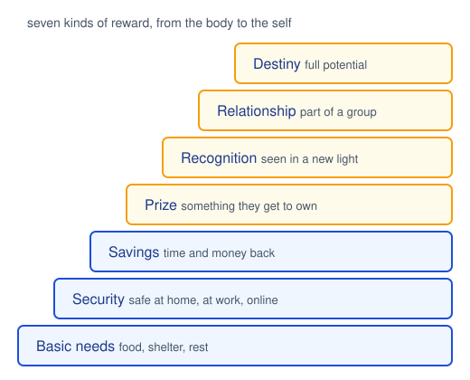
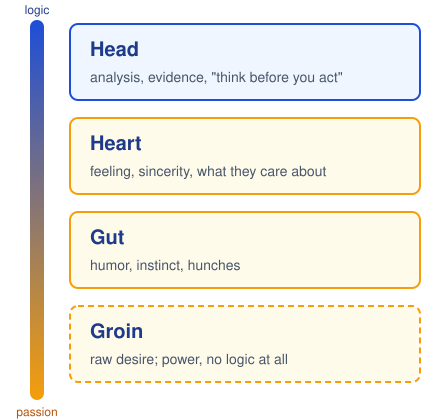
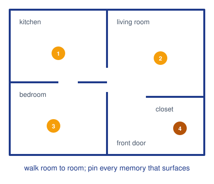

# CPSC 403: Computer Science Seminar

## Week 4, September 29, 2026

Resonate, the rest of Chapter 4, then Chapter 5: Create Meaningful Content.

Trinity College · Fall 2026

---
layout: two-cols
---

# Check in

Scan the code, pick your name, pick today's section, and type the code word. Lowercase, but I am not picky about case.

Code word: <strong>roybatty</strong>

Same form every week, different word. Timestamps count as attendance.

::right::

---
layout: center
---

# Today

<v-clicks>

- Housekeeping, and one correction
- Finish Chapter 4: resistance, rewards, and a case study
- Chapter 5: generate far more than you need, give it meaning, then cut
- Turn your project topics into messages
- Today's talks, with feedback after each

</v-clicks>

---

# Housekeeping

<v-clicks>

- **Correction.** *Heart of Darkness* is by Joseph Conrad, who was Polish-born and British. Joseph Campbell, the hero's-journey Campbell, was American. I tangled them twice.
- **Post-mortem 1** is due one week after your talk. Liu and Ethan: that is today.
- **Presenting today?** Slides to Moodle before you start, one upload for the round.
- **Sign-up sheet:** Round 1 ends October 27 in Section 01. If you are not on the sheet yet, see me before you leave.
- Last week's recordings are on the Class recordings page, both sections.

</v-clicks>

---
layout: section
---

# Chapter 4, continued
## Resistance and reward

---

# Refusal of the call: six places to look

<strong>Comfort zone.</strong> How far outside it are you asking them to go?

<strong>Fear.</strong> What keeps them up at night? Which fears are valid, which need dispelling?

<strong>Vulnerabilities.</strong> Recent errors, weaknesses, changes they are still absorbing.

<strong>Misunderstanding.</strong> What could they get wrong about the message or its implications?

<strong>Obstacles.</strong> What practical or mental barrier stops them acting even if they agree?

<strong>Politics.</strong> Who has influence over them? Does your idea shift power?

For the December pitch, the faculty resistance is predictable: "too big for two people in one semester," "who owns the data," "what happens when the API changes." Name them before they do.

---
layout: two-cols
---

# Make the reward worth it

<v-clicks>

- Nobody acts because a talk was engaging. They act because the payoff was clear and worth the sacrifice.
- The reward should be proportional to what you asked them to give up.
- Three scopes: what **they** get, what their **sphere** gets (team, friends, students), and what the wider **world** gets.
- The hero returns from the special world with an elixir. Name the elixir.

</v-clicks>

Last week's "new bliss" now has a definition: the reward, stated so they can feel it.

::right::

---
layout: image-right
image: ./images/beth-comstock.jpg
---

# Case study: "Growth in a downturn?"

<v-clicks>

- General Electric, 2008. Beth Comstock, GE's first chief marketing officer in decades, had to convince her team that growth was possible while the economy collapsed.
- The contrast is in the title. What is: a downturn. What could be: growth anyway.
- Six moves, each a "move from, move to" pair with a benefit and a personal story.
- The stories were her own mistakes: passion that read as aggression, not asking for help. That is what made the ask credible.

</v-clicks>

---

# The move-from, move-to matrix

| | **Move from** | **Move to** | **Benefit** | **Personal story** |
|---|---|---|---|---|
| **Being** (belief) | Paralyzed by not knowing the answers | Accepting you never will | You face reality and make the call | "Jack Welch taught me to wallow in a problem" |
| **Doing** (action) | Afraid to start | Pick a path, knowing the end will differ | Fail fast, fail small | "I regret the times I stayed quiet" |

One of Comstock's six, condensed. A row for belief, a row for action, and the story is hers, not a stock anecdote.

For your project pitch: <strong>from</strong> "this is a student exercise" <strong>to</strong> "this is a tool someone will use." What is the benefit to the room, and what story of yours makes it credible?

---
layout: image-right
image: ./images/newton-kneller.jpg
---

# Rule 4: A body at rest stays at rest

<v-clicks>

- Duarte's wording: every audience will persist in a state of rest unless compelled to change. Newton's first law, applied to a room. Nobody changes because you asked nicely.
- The compelling force is what is at stake, stated plainly, with a reward on the other side of the sacrifice.
- If your talk has no force in it, the audience will be exactly where they started when you finish. That is not their failure.

</v-clicks>

---
layout: section
---

# Chapter 5
## Create Meaningful Content

---
layout: image-right
image: ./images/gold-panning.jpg
---

# Pan for gold first

<v-clicks>

- Do not open PowerPoint or Slidev yet. This phase is about ideas, not slides.
- **Collect:** papers, docs, competitors, forum threads, the data, what the client already told you. Scoop from many places; you do not know which pan holds the nugget.
- **Create:** ideas nobody has attached to your topic before. Sticky notes, one idea each, no judging.
- The first idea is rarely the best. The good ones tend to show up in the third or fourth round.

</v-clicks>

Divergent thinking: go wide on purpose. Messy is correct here.

---
layout: image-right
image: ./images/aristotle-altemps.jpg
---

# Facts are not enough

Aristotle named three ways to persuade:

<v-clicks>

- **Ethos:** why they should trust you. Shared values, a track record, honesty about limits.
- **Logos:** a claim, the evidence, a structure that holds together. Every talk needs it.
- **Pathos:** what they feel. People decide on emotion and then justify with reasons.

</v-clicks>

A CS talk tends to be all logos. Fact after fact makes the audience do the work of figuring out which one matters. Emotion is how you point at it.

---
layout: two-cols
---

# Don't be so cerebral

<v-clicks>

- Randy Olson, a marine biologist turned filmmaker, sorts communication by where it comes from: head, heart, gut, groin.
- Engineering culture rewards the head. The lower regions are where passion, hunches, humor, and even hypotheses come from.
- Generate from the gut first. Imagine what could be before opening the spreadsheet.
- Then go back to the head and check. The analysts in the room still want proof, and without it you lose them.

</v-clicks>

::right::

---

# Contrast gets the applause

In 1986, John Heritage and David Greatbatch studied 476 British political speeches to find out what came right before the applause.

Nearly <strong>half</strong> of the applause followed a contrast.

For every idea you hold, somebody in the room holds the opposite. Know what it is, even if you never say it.

| **What is** | **What could be** |
|---|---|
| Their point of view | Your point of view |
| Past and present | Future |
| Problem | Solution |
| Roadblocks | Clear passage |
| Impossible | Possible |
| Information | Insight |
| Ordinary | Special |

These pairs are the ups and downs of the sparkline.

---
layout: image-right
image: ./images/teacup.jpg
---

# Meaning, not features

<v-clicks>

- Duarte kept one thing from her grandmother's house: a stained teacup worth nothing at a yard sale. She drank from it for hours while her grandmother told stories.
- Value comes from what a thing means to a person, not what it is.
- A medical device matters because it saves a life, not because of its alloy. Your system matters because of what someone can now do with it.
- No human in the talk, no meaning in the talk.

</v-clicks>

---
layout: two-cols
---

# Find your own stories

<v-clicks>

- When you want the room to feel something, tell about a time you felt it. It is credible because it is yours.
- Chronology works, but it finds the stories you already tell. Try **people, places, things** instead.
- **Places:** sketch a floor plan of a house, a dorm, a lab. Walk it room by room. Forgotten scenes come back.
- **People:** mentors, rivals, bosses, teammates. **Things:** objects you kept for no rational reason.
- Keep a list. You will need one story for Round 2 and several in December.

</v-clicks>

::right::

---

# A story in six moves

A story can be one sentence long. "Last spring our demo crashed in front of the client, so we built the retry logic you are about to see." Beginning, conflict, resolution, point.

---
layout: image-right
image: ./images/houdini-challenge.jpg
---

# Do the trick before you explain it

<v-clicks>

- Duarte's Cisco case: a slide listing network features, accurate and forgettable. It answered what and how, never why.
- The rework told the story of a small business owner who ran his business better because of the network. Same product, now with a hero.
- The fastest way to lose a room is to explain how the trick works before you have performed it.
- Show what it lets a person do. Then, once they care, open the hood.

</v-clicks>

---
layout: image-right
image: ./images/hans-rosling.jpg
---

# Numbers need a narrator

<v-clicks>

- **Scale:** 1,350 cameras at 30 frames a second is 40,500 frames every second. No room of people can watch that.
- **Compare:** Intel at CES 2010: if cars had improved like chips, they would go hundreds of thousands of miles an hour and cost pennies.
- **Context:** say why the line went up or down, not just that it did.
- Hans Rosling animated forty years of fertility against life expectancy, and the room watched the world change.

</v-clicks>

---
layout: two-cols
---

# Murder your darlings

<v-clicks>

- Now switch to convergent thinking. Most talks suffer from too many ideas, not too few.
- The filter is your big idea. If an idea does not clearly support it, it goes, however much work it took.
- Nobody leaves a talk wishing it had been longer. They want more clarity, not more content.
- Check the survivors: did your contrast make it through the cut?

</v-clicks>

The phrase is Arthur Quiller-Couch's, 1914, about fine writing.

::right::

---
layout: two-cols
---

# From topics to messages

<v-clicks>

- Cluster what survived into three to five topics. **MECE**, the McKinsey test: mutually exclusive (no overlap), collectively exhaustive (nothing missing).
- A topic is a label. A **message** is a full sentence with a charge.
- Build contrast into each message. If a first attempt failed, say so before pitching the second.

</v-clicks>

<strong>Topic:</strong> "Latency."

<strong>Message:</strong> "Today a clinician waits forty seconds for an answer; by April it will be under two."

::right::

---
layout: image-right
image: ./images/tuning-fork.jpg
---

# Rule 5: Filter for the resonant frequency

<v-clicks>

- A tuning fork rings at one frequency. Strike it and every other tone dies away.
- Your big idea is that frequency. Everything you generated this week is noise until it passes through that filter.
- Generate hundreds of ideas. Deliver the few that ring.

</v-clicks>

---

# Topics into messages (five minutes)

For your **project pitch** in Round 2, on paper or in a note you will keep:

1. **Big idea.** One sentence: your perspective, the stakes, the word "you."
2. **Three topics** that tile it without overlap. Problem, approach, plan is a fine start.
3. **Three messages.** Rewrite each topic as a full sentence with a what is / what could be contrast inside it.

Keep it. These three sentences are the skeleton of your Round 2 talk, and Chapter 6 next week is about arranging them.

---
layout: center
---

# Today's presenters

Section 01, 1:30

1. Noella Uwayisenga

2. Biruktayit Habtegiorgis and Gabe Koomson, <em>Good news around the world</em>

Section 02, 2:55

1. Gabriela Scavenius

While you listen: where is the **contrast**? Is there a **human** in it, or just facts? What would you **cut**? Say what landed, then one thing to change.

---

# Round 1: where the sheet stands

**Section 01**

| Date | Presenters |
|---|---|
| Sept 22 | Liu ✓, Ethan ✓ |
| Sept 29 | Noella, Biruk and Gabe, *open* |
| Oct 6 | Sean, Ralston (two slots?) |
| Oct 20 | Taha, Shane and Sarah, Shamsher |
| Oct 27 | Zoe and Kayla, AJ, *open*, *open* |

**Section 02**

| Date | Presenters |
|---|---|
| Sept 29 | Gabby, *open*, *open* |
| Oct 6 | Allan and Varya, Sloane, *open* |
| Oct 20 | Jeev, *open*, *open* |

Four people are not on the sheet yet. Anyone may present in the other section. Pick a slot today.

---
layout: center
---

# For next week

- Presenters today: **post-mortem 1** due in one week on Moodle. What you intended, what happened, what you would change.
- October 6 presenters: slides to Moodle before class.
- Read Chapter 6, *Structure Reveals Insights*: how to arrange the messages you wrote today.
- Keep your three messages. We use them next week.

---
layout: center
class: text-sm
---

**Image credits.** Gold pan, Nate Cull, Wikimedia Commons, CC BY 2.0. Aristotle, Roman copy after Lysippos, Palazzo Altemps, public domain. Teacup and saucer, Metropolitan Museum of Art, CC0. "Challenge to Houdini" poster, Regent Theatre, Salford, public domain. Hans Rosling, photograph by David Shankbone, CC BY 3.0. Tuning fork 288 Hz, K. Venkataramana, CC0. Beth Comstock, photograph by Joi Ito, CC BY 2.0. Portrait of Sir Isaac Newton, after Godfrey Kneller, public domain. Diagrams drawn for this course.
