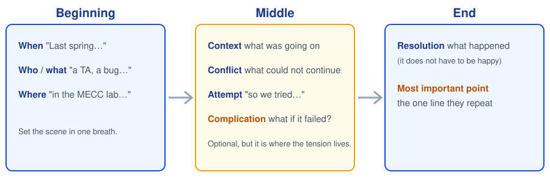
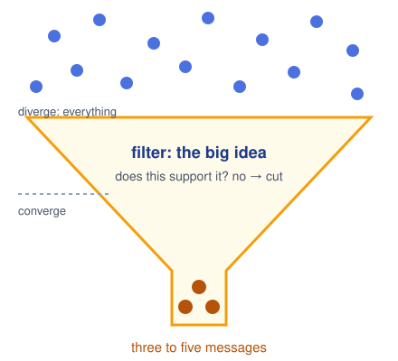
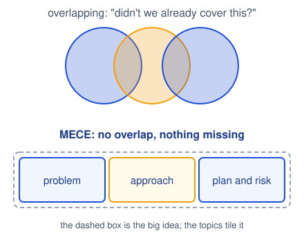
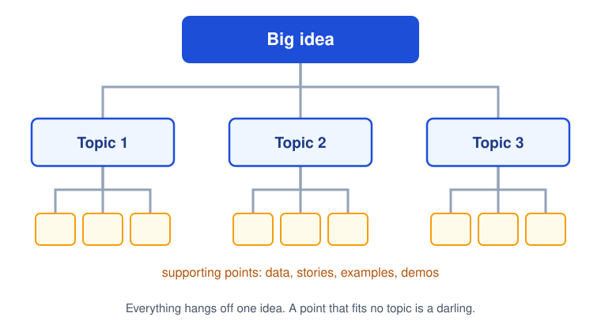
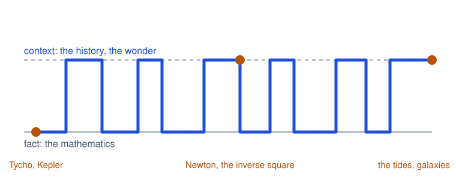
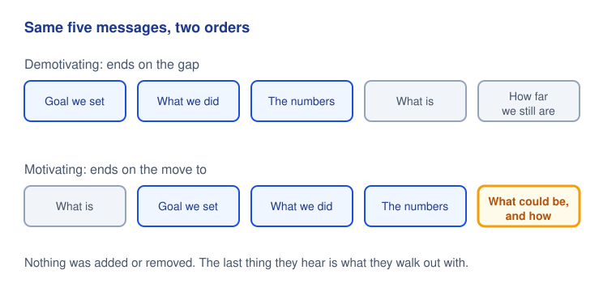
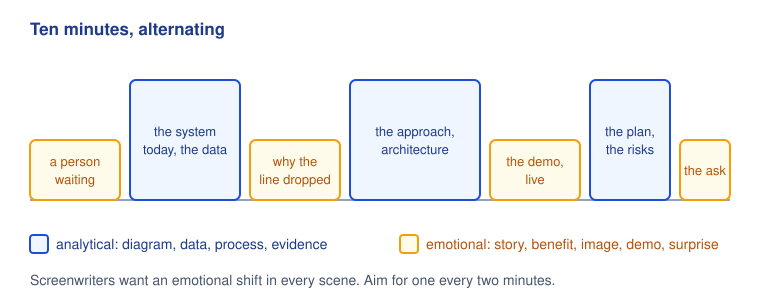
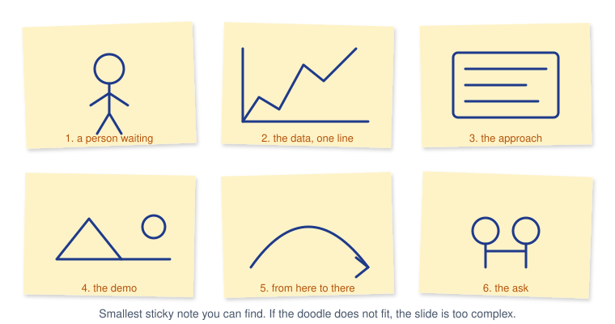
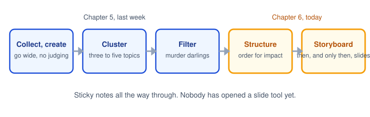

# CPSC 403: Computer Science Seminar

## Week 5, October 6, 2026

Resonate, the rest of Chapter 5, then Chapter 6: Structure Reveals Insights.

Trinity College · Fall 2026

---
layout: two-cols
---

# Check in

Scan the code, pick your name, pick today's section, and type the code word. Lowercase, but I am not picky about case.

Code word: <strong>skynet</strong>

Same form every week, different word. Timestamps count as attendance.

::right::

---
layout: center
---

# Today

<v-clicks>

- Housekeeping: a date, a correction, and a newsletter
- Finish Chapter 5: stories, numbers, and the cut
- Chapter 6: arrange the messages so the structure does the work
- Structure your three messages
- Today's talks, with feedback after each

</v-clicks>

---

# Housekeeping

<v-clicks>

- **The student conference is Wednesday, December 16.** That is the preliminary pitch to faculty and the Travelers representative. Put it on your calendar now.
- **Correction.** Last week I said post-mortems had no deadline before the end of the semester. Wrong. A post-mortem is due **one week after your talk**; the Moodle date (November 3 for Post-Mortem 1) is only the outer limit. And: specific moments, not timestamps. The recordings are not good enough to cite by the minute.
- **Announcements forum:** a short newsletter piece on answering "tell me about yourself." Optional, not graded, fifteen minutes well spent.
- **No class October 13** (Trinity Days). We meet again October 20.
- **AI Center** meets **Thursday at 4:30**, not Friday, this week only.

</v-clicks>

---
layout: section
---

# Chapter 5, continued
## Stories, numbers, and the cut

---

# A story in six moves

A story can be one sentence long. "Last spring our demo crashed in front of the client, so we built the retry logic you are about to see." Beginning, conflict, resolution, point.

---
layout: image-right
image: ./images/houdini-challenge.jpg
---

# Do the trick before you explain it

<v-clicks>

- Duarte's Cisco case: a slide listing network features, accurate and forgettable. It answered what and how, never why.
- The rework told the story of a small business owner who ran his business better because of the network. Same product, now with a hero.
- The fastest way to lose a room is to explain how the trick works before you have performed it.
- Show what it lets a person do. Then, once they care, open the hood.

</v-clicks>

---
layout: image-right
image: ./images/hans-rosling.jpg
---

# Numbers need a narrator

<v-clicks>

- **Scale:** 1,350 cameras at 30 frames a second is 40,500 frames every second. No room of people can watch that.
- **Compare:** Intel at CES 2010: if cars had improved like chips, they would go hundreds of thousands of miles an hour and cost pennies.
- **Context:** say why the line went up or down, not just that it did.
- Hans Rosling animated forty years of fertility against life expectancy, and the room watched the world change.

</v-clicks>

---
layout: two-cols
---

# Murder your darlings

<v-clicks>

- Now switch to convergent thinking. Most talks suffer from too many ideas, not too few.
- The filter is your big idea. If an idea does not clearly support it, it goes, however much work it took.
- Nobody leaves a talk wishing it had been longer. They want more clarity, not more content.
- Check the survivors: did your contrast make it through the cut?

</v-clicks>

The phrase is Arthur Quiller-Couch's, 1914, about fine writing.

::right::

---
layout: two-cols
---

# From topics to messages

<v-clicks>

- Cluster what survived into three to five topics. **MECE**, the McKinsey test: mutually exclusive (no overlap), collectively exhaustive (nothing missing).
- A topic is a label. A **message** is a full sentence with a charge.
- Build contrast into each message. If a first attempt failed, say so before pitching the second.

</v-clicks>

<strong>Topic:</strong> "Latency."

<strong>Message:</strong> "Today a clinician waits forty seconds for an answer; by April it will be under two."

::right::

---
layout: image-right
image: ./images/tuning-fork.jpg
---

# Rule 5: Filter for the resonant frequency

<v-clicks>

- A tuning fork rings at one frequency. Strike it and every other tone dies away.
- Your big idea is that frequency. Everything you generated this week is noise until it passes through that filter.
- Generate hundreds of ideas. Deliver the few that ring.

</v-clicks>

---

# Topics into messages (five minutes)

For your **project pitch** in Round 2, on paper or in a note you will keep:

1. **Big idea.** One sentence: your perspective, the stakes, the word "you."
2. **Three topics** that tile it without overlap. Problem, approach, plan is a fine start.
3. **Three messages.** Rewrite each topic as a full sentence with a what is / what could be contrast inside it.

Keep it. These three sentences are the skeleton of your Round 2 talk, and the rest of today is about arranging them.

---
layout: section
---

# Chapter 6
## Structure Reveals Insights

---
layout: image-right
image: ./images/pearl-necklace.jpg
---

# Structure is the string

<v-clicks>

- You have messages. Now arrange them so the relationship between the parts and the whole is visible.
- Duarte's images: the couplings on a train, the string in a pearl necklace. The string is invisible and holds everything in order.
- Without it the pearls are loose on the floor, and loose ideas are forgotten ideas.
- Structural problems are the most common cause of failed presentations. If the structure works, the talk works.

</v-clicks>

---
layout: image-right
image: ./images/watch-disassembled.jpg
---

# Don't fling the watch parts

<v-clicks>

- H. M. Boettinger's warning: dumping unstructured research on an audience is like taking a watch apart, throwing the pieces at them, and saying "here is everything you need to make a watch."
- You get credit for effort. That is a consolation prize. It also confesses that you did not know what to do with what you found.
- Audiences expect structure. The senior project talk that lists every library you tried is flinging parts.

</v-clicks>

---
layout: image-right
image: ./images/sticky-notes-wall.jpg
---

# Get out of the slide tool

<v-clicks>

- Slide tools make slides one after another. That pulls your attention down into each slide and away from the shape of the talk.
- Sticky notes on a wall, printouts on the floor, anything spatial. See the whole thing at once.
- Clusters show you where the weight is: how many points each message has, how much time it will take, where the holes are.
- Arrange it for *their* comprehension, not yours. Links that are obvious to the expert are invisible to the room.

</v-clicks>

---
layout: two-cols
---

# Outlines beat slide decks

<v-clicks>

- The common shape is topical: one big idea, topics cascading from it, points hanging off each topic.
- Duarte's story: a marketing chief whose CEO derailed every slide pitch by the fourth slide, hunting for his pet content. The team handed him an outline instead. He saw the structure, found his item, and spent the hour building on their ideas.
- A one-page outline shows the whole, not the parts. It also lets a reviewer give you useful feedback in five minutes.
- The advisor meeting before your December pitch: bring the outline, not the deck.

</v-clicks>

::right::

---

# Eight ways to arrange it

Four with a natural, story-like shape:

<strong>Chronological.</strong> Events in time order, forward or back.

<strong>Sequential.</strong> Step by step: a process, a rollout.

<strong>Spatial.</strong> How things sit together in a physical space.

<strong>Climactic.</strong> Least important to most important.

Four with contrast built in, for talks that have to persuade:

<strong>Problem, solution.</strong> Establish the problem first; it makes the case for change.

<strong>Compare, contrast.</strong> Two things side by side. Insight surfaces in the gap.

<strong>Cause, effect.</strong> What leads to what. Good when you want action.

<strong>Advantage, disadvantage.</strong> Let them weigh both sides.

Pick the one that best carries your big idea, for the whole talk or inside one topic. Whichever you pick, <strong>tell them where you are</strong>: "That was the problem. Here is what we are building." A verbal signpost costs five seconds.

---
layout: image-right
image: ./images/feynman-los-alamos.jpg
class: text-sm
---

# Case study: Richard Feynman

<v-clicks>

- Caltech students who were not physics majors dropped into his lectures for fun. They called him the Great Explainer.
- His theory, from a BBC interview: be deliberately chaotic and catch each listener on a different hook. The history person is bored by the math, the math person by the history, so nobody is bored all the time.
- **Analytical devices:** signal the structure up front, itemize ("three things"), visualize with gestures more than symbols.
- **Emotional devices:** wonder, and self-deprecating humor at even intervals.

</v-clicks>

---

# Feynman's sparkline

<strong>The gravity lecture.</strong> A whole talk of <em>what is</em>. Zoom in and it still alternates: Tycho's data, then the law; Kepler's ellipses, then the inverse square; the equation, then the tides. Fact, context, fact, context.

<strong>"There's Plenty of Room at the Bottom."</strong> The laws of physics as they are, then the same laws at the scale of atoms, where machines could be built. What is, what could be, at a tighter frequency than most non-technical talks.

A technical talk is not excused from contrast. It just alternates on a shorter cycle.

---

# Order the messages for impact

Duarte's example is a quarterly update. Same slides. One order sends employees out deflated; the other sends them out ready to help. The association between pieces changes what each piece means.

---

# Two kinds of content

<strong>Analytical.</strong> Diagram, feature, data, evidence, example, system, process, facts, supporting documentation.

Every hard drive on campus is full of these slides.

<strong>Emotional.</strong> Stories, benefits, analogies, a prop, a reveal, an evocative image, a shocking number, an invitation to marvel, humor, a surprise.

A tiny fraction of decks have even one.

<v-clicks>

- Anything on the left can be told from the right. A circle inside a bigger circle is neutral until it is the story of the acquisition and what it took to get there.
- Data is analytical until you say why the line went up or down. Then it is a story.
- Peter Guber's point: the room's physical response, the laugh, the gasp, the wince, is part of the story. You orchestrate it.

</v-clicks>

---

# Alternate, like a screenwriter

Screenwriters check that every scene shifts the emotion, and that the shifts alternate between pain and pleasure. Go through your outline and mark each message A or E. Three A's in a row is where the room checks its phone.

---

# Contrast the delivery too

| **Traditional** | **Less traditional** |
|---|---|
| Hide behind the podium | Move |
| Read the slides | Minimize the slides |
| Talk about the product | Show the product |
| Flawless knowledge | A little self-deprecation |
| Monotone | Vary the voice and the pace |
| One-way delivery | A poll, a show of hands, a question |

<v-clicks>

- Audiences raised on screens squirm after ten minutes of one thing. Something new has to keep happening.
- Every slide you drop is a moment of human connection you get back. They came to see a person, not a deck.
- Mode changes need planning. In a ten-minute talk, one is plenty: a live demo, a question to the room, a prop.
- Last week Biruk and Gabe switched speakers; Noella and Gabby asked the room. Both counted.

</v-clicks>

---
layout: image-right
image: ./images/hitchcock.jpg
---

# Storyboard it, like Hitchcock

<v-clicks>

- Hitchcock drew his films before he shot them: sets, costumes, every camera angle, down to how many birds were in the frame and how far away the camera stood.
- Drawn, not just written. The planning saved time and money on the set, and the film in his head was the film on the screen.
- A storyboard does the same for a talk: tape it to the wall, look at the sequence, the transitions, the framing, and see whether it hangs together before you build anything.
- Walt Disney put it plainly: at his studio they drew their stories rather than wrote them.

</v-clicks>

---

# Storyboard on the smallest sticky note

<v-clicks>

- Dan Roam's point in *Back of the Napkin*: real problems are multidimensional, and you cannot fully understand one until you draw it.
- Doodles, not art. One sticky per slide, the smallest size you can find, so you cannot overfill it.
- If the sketch is too complex, time-consuming, or costly, cut it now and find another way to carry that message.
- Say the talk out loud and draw what you hear yourself say. If you can draw it, they can see it.

</v-clicks>

---

# The process so far

Notice what is missing. Nobody has opened Slidev, Keynote, or PowerPoint. The deck is the last thing you make, and by then you already know what every slide is for.

---
layout: image-right
image: ./images/watch-disassembled.jpg
---

# Rule 6: Structure is greater than the sum of its parts

<v-clicks>

- Duarte's wording, roughly: a leaf, a building, and ice cream all have structure, and structure drives the shape and expression of each. Same for a talk.
- The assembled watch in that photo is the same parts as the ones laid out around it. The difference is the arrangement.
- Change the structure, large or small, and you change how the content is received. Pull the talk out of the slide tool, check the shape, and only then arrange for impact.

</v-clicks>

---

# Structure your three messages (five minutes)

Take the three messages from the top of class, or from last week if you kept them.

1. **Pick a structure** from the eight. Problem-solution is the default for a pitch; say if you chose otherwise and why.
2. **Order them so the last one is the move to.** What does the room walk out holding?
3. **Mark each A or E.** If all three are analytical, pick one and find the human in it.
4. **Six sticky notes.** Doodle the six slides of a ten-minute pitch. No words beyond a label.

Keep it with the messages. That is your Round 2 outline, and Chapter 7 (October 20) is about the moment in it they will remember.

---
layout: center
---

# Today's presenters

Section 01, 1:30

1. Sean Balbale

2. Ralston Raphael

Section 02, 2:55

1. Allan Mukkuzhi and Varvara Esina

While you listen: can you **name the structure**? Did it **end on the move to**? Where did it **alternate** between facts and feeling? Say what landed, then one thing to change.

---

# Round 1: where the sheet stands

**Section 01**

| Date | Presenters |
|---|---|
| Sept 22 | Liu ✓, Ethan ✓ |
| Sept 29 | Biruk and Gabe ✓ |
| Oct 6 | Sean, Ralston, *open* |
| Oct 20 | Taha, Shane and Sarah, Shamsher |
| Oct 27 | Zoe and Kayla, AJ, Patrick, *open* |

**Section 02**

| Date | Presenters |
|---|---|
| Sept 29 | Gabby and Noella ✓ |
| Oct 6 | Allan and Varya, *open*, *open* |
| Oct 20 | Jeev, Sloane, Amraa |

Two people are not on the sheet yet. Four Round 1 slots are open. Anyone may present in the other section.

---
layout: center
---

# For October 20

- Presenters today: **post-mortem 1** due in one week on Moodle. What you intended, what happened, what you would change. Specific moments, not timestamps.
- October 20 presenters: slides to Moodle before class. Six talks that day, so ten minutes means ten.
- Read Chapter 7, *Deliver Something They'll Always Remember*: the S.T.A.R. moment.
- Keep the outline and the six sticky notes from today.
- No class October 13. Enjoy Trinity Days.

---
layout: center
class: text-sm
---

**Image credits.** Long pearl necklace, W.carter, Wikimedia Commons, CC BY 4.0. Prim wristwatch disassembled, Kozuch, CC BY-SA 3.0. Brainstorming at a Code The City hack event, Watty62, CC BY-SA 4.0. Richard Feynman, Los Alamos ID badge, United States Army, public domain. Alfred Hitchcock, Fred Palumbo for the New York World-Telegram and Sun, public domain. "Challenge to Houdini" poster, public domain. Hans Rosling, David Shankbone, CC BY 3.0. Tuning fork, K. Venkataramana, CC0. Diagrams drawn for this course.
